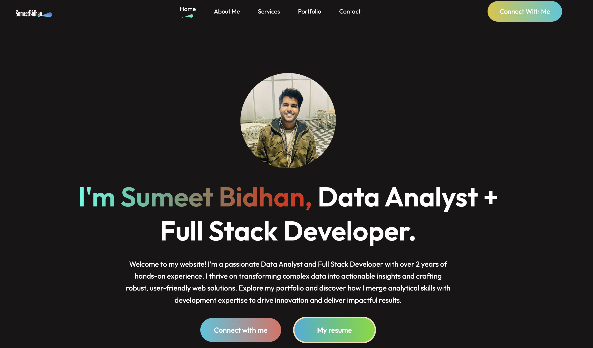

# Portfolio Website

## Introduction
Welcome to my portfolio website! This project is built using React and showcases my skills, projects, and contact information. Feel free to explore and reach out to me for any inquiries or collaborations.

## Preview


## Technologies Used
- React
- JavaScript
- HTML
- CSS

## Getting Started
1. Clone this repository to your local machine using the command:
   ```
   git clone https://github.com/sumeetbidhan/sumeetbidhanreact
   ```
2. Navigate to the project directory:
   ```
   cd your-repo
   ```
3. Install dependencies using npm:
   ```
   npm install
   ```
4. Start the development server:
   ```
   npm start
   ```
5. Open your browser and visit `http://localhost:3000` to view the website.

## Project Structure
The project structure is organized as follows:
- **src**: Contains the source code of the website.
  - **Components**: Reusable React components used throughout the website.
    - Navbar: Navigation bar component.
    - Hero: Hero section component with video background.
    - About: About section component.
    - Services: Services section component.
    - MyWork: Portfolio/projects section component.
    - Contact: Contact form component.
    - Footer: Footer component.
    - PortfolioVideo: Video component for showcasing the portfolio.
  - **App.js**: Main entry point of the application, rendering all components.
- **public**: Contains public assets such as images, icons, and the index.html file.


## Deployment
To deploy the website:
1. Build the project using:
   ```
   npm run build
   ```
2. Deploy the contents of the `build` folder to your hosting provider.


## Author
[Sumeet Bidhan] - [https://sumeetbidhan.netlify.app/]

## License
This project is licensed under the MIT License - see the [LICENSE](LICENSE) file for details.

